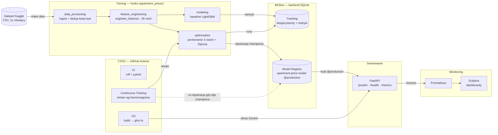

# Architektura systemu

Predykcja cen mieszkań w Polsce (regresja) zbudowana jako **monorepo MLOps**: trening
w Kedro, śledzenie i rejestr modeli w MLflow, serwowanie w FastAPI, monitoring w
Prometheus/Grafana, dostarczanie przez GitHub Actions.



<details>
<summary>Źródło diagramu (Mermaid — renderuje się na GitHubie)</summary>



</details>

## Komponenty

### Trening — Kedro (`training/`, pakiet `apartment_prices`)

Cztery pipeline'y o jawnym przepływie danych (katalog Kedro, 8 warstw `data/`):

| Pipeline | Wejście → wyjście | Rola |
|----------|-------------------|------|
| `data_processing` | `01_raw` (11 CSV) → `03_primary` | scalenie miesięcy, **deduplikacja keep-last po `id`**, czyszczenie |
| `feature_engineering` | `03_primary` → `05_model_input` | `engineer_features` — kontrakt 26 cech (wspólny z serwisem) |
| `modeling` | `model_input` → `model` + `metrics` | baseline LightGBM, split **grupowy po `id`**, metryki w PLN |
| `optimization` | `model_input` → leaderboard + champion | porównanie 3 rodzin, **Optuna** (TPE, GroupKFold), rejestracja w MLflow |

Funkcja `engineer_features` żyje w **`apartment_prices.features`** (czysty pandas, bez
Kedro) — ta sama funkcja działa w notebooku baseline, w Kedro i — przez `code_paths` — w
artefakcie modelu serwowanym przez FastAPI. Dzięki temu cechy liczą się **tym samym kodem** w treningu i przy predykcji.

### MLflow (backend SQLite, lokalnie)

Śledzenie eksperymentów (porównanie modeli, próby Optuny) i **Model Registry**.
Champion jest zarejestrowany jako `apartment-price-model` z aliasem **`@production`**.
Model to kompletny `sklearn.Pipeline` (`engineer_features` → `TransformedTargetRegressor`
z `log1p/expm1` wokół LightGBM) — przyjmuje surowe cechy i zwraca cenę w PLN.

### Serwowanie — FastAPI (`serving/`, pakiet `apartment_serving`)

Endpointy: **`/predict`** (cena w PLN), **`/health`** (liveness), **`/metrics`**
(Prometheus). Model ładowany przez `mlflow.pyfunc` — z rejestru (`models:/...@production`,
dev) lub z zamontowanego katalogu (`MODEL_URI=/app/model`, Docker). Obraz Dockera jest
**lekki** (bez Kedro/MLflow-server; kod cech jest dołączany do modelu przez `code_paths`).

### Monitoring — Prometheus + Grafana

Prometheus scrape'uje `/metrics`: licznik predykcji, histogram latencji, rozkład
przewidywanych cen oraz rozkład metrażu wejść (**sygnał driftu danych**). Grafana z
provisioningiem (datasource + dashboard) wizualizuje te metryki.

### CI/CD — GitHub Actions

- **CI** (`ci.yml`): `uv sync --frozen` + `ruff` + `pytest` na każdym PR/push.
- **CD** (`cd.yml`): po zielonym CI — build & push obrazu API do **ghcr.io** (tagi branch/semver/sha/latest).
- **Continuous Training** (`continuous-training.yml`): zaplanowany retrening (pobranie
  danych z Kaggle → Kedro + Optuna → porównanie z `champion_reference.json`).

## Przepływ danych (end-to-end)

```
Kaggle CSV → make data → 01_raw
  → data_processing (dedup keep-last po id) → 03_primary
  → feature_engineering (26 cech) → 05_model_input
  → modeling (baseline) / optimization (Optuna → champion)
  → MLflow Registry (@production)
  → FastAPI /predict → Prometheus → Grafana
```

## Kluczowe decyzje projektowe (skrót)

| Decyzja | Uzasadnienie |
|---------|--------------|
| Monorepo uv (training + serving) | rozdział ciężkiego treningu od lekkiego serwowania, wspólny lock |
| Deduplikacja keep-last + split grupowy po `id` | kontrola **wycieku tożsamości** mieszkania (losowy split zawyża R²) |
| Target `log1p(price)` | cena jest prawostronnie skośna (skośność 1,76 → 0,07) |
| Natywne kategorie LightGBM (bez OHE) | drzewa dzielą kategorie natywnie; brak niesie sygnał |
| Model = `Pipeline(FE + TTR)` w Registry | te same cechy w treningu i produkcji, serwowanie pełnego artefaktu |
| MLOps ścieżka B (CI/CD + CT) | branżowy standard pasujący do pracy z Dockerem |

## Stos technologiczny

Python 3.12 · uv · Kedro · scikit-learn · LightGBM · Optuna · MLflow · FastAPI ·
Uvicorn · Pydantic · Prometheus · Grafana · Docker · GitHub Actions · ruff · pytest.
